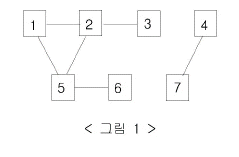

# 바이러스 성공

| 시간 제한 | 메모리 제한 | 제출   | 정답  | 맞힌 사람 | 정답 비율 |
| --------- | ----------- | ------ | ----- | --------- | --------- |
| 1 초      | 128 MB      | 196595 | 93073 | 61729     | 46.127%   |

## 문제

신종 바이러스인 웜 바이러스는 네트워크를 통해 전파된다. 한 컴퓨터가 웜 바이러스에 걸리면 그 컴퓨터와 네트워크 상에서 연결되어 있는 모든 컴퓨터는 웜 바이러스에 걸리게 된다.

예를 들어 7대의 컴퓨터가 <그림 1>과 같이 네트워크 상에서 연결되어 있다고 하자. 1번 컴퓨터가 웜 바이러스에 걸리면 웜 바이러스는 2번과 5번 컴퓨터를 거쳐 3번과 6번 컴퓨터까지 전파되어 2, 3, 5, 6 네 대의 컴퓨터는 웜 바이러스에 걸리게 된다. 하지만 4번과 7번 컴퓨터는 1번 컴퓨터와 네트워크상에서 연결되어 있지 않기 때문에 영향을 받지 않는다.

어느 날 1번 컴퓨터가 웜 바이러스에 걸렸다. 컴퓨터의 수와 네트워크 상에서 서로 연결되어 있는 정보가 주어질 때, 1번 컴퓨터를 통해 웜 바이러스에 걸리게 되는 컴퓨터의 수를 출력하는 프로그램을 작성하시오.

!

## 입력

첫째 줄에는 컴퓨터의 수가 주어진다. 컴퓨터의 수는 100 이하인 양의 정수이고 각 컴퓨터에는 1번 부터 차례대로 번호가 매겨진다. 둘째 줄에는 네트워크 상에서 직접 연결되어 있는 컴퓨터 쌍의 수가 주어진다. 이어서 그 수만큼 한 줄에 한 쌍씩 네트워크 상에서 직접 연결되어 있는 컴퓨터의 번호 쌍이 주어진다.

## 출력

1번 컴퓨터가 웜 바이러스에 걸렸을 때, 1번 컴퓨터를 통해 웜 바이러스에 걸리게 되는 컴퓨터의 수를 첫째 줄에 출력한다.

## 예제 입력 1

```
7
6
1 2
2 3
1 5
5 2
5 6
4 7

```

## 예제 출력 1

```
4
```

---

## 풀이

```cpp
#include <iostream>
#include <vector>
#include <algorithm>
using namespace std;

vector<int> graph[101];
bool visited[101];
int cnt = 0;

void DFS(int node) {
    visited[node] = true;

    for (int i = 0; i < graph[node].size(); i++) {
        int next = graph[node][i];
        if (!visited[next]) {
            //cout << node << i << next << endl;
            cnt++;
            DFS(next);
        }
    }
}
int main() {
    // 컴퓨터의 수, 연결된 컴퓨터 쌍의 수
    int n, m;
    cin >> n >> m;

    // 그래프 입력
    for (int i = 0; i < m; i++) {
        int a, b;
        cin >> a >> b;
        graph[a].push_back(b);
        graph[b].push_back(a);
    }

    // 정렬
    for (int i = 1; i <= n; i++) {
        sort(graph[i].begin(), graph[i].end());
    }

    // 1번 컴퓨터부터 바이러스 감염 시작
    DFS(1);

    cout << cnt << endl;

    return 0;
}
```

## 느낀점

굳이 fill로 visited 초기화를 해줘야하나? → 더 찾아봐야할듯

입출력 최적화 다음부터 적용하기 →

```
• cin.tie(NULL); ios::sync_with_stdio(false);
```

DFS는 참 어렵다.. 이것만 하면 쉬운데,, 프로그래머스만 가면 감이 안잡히넹..
